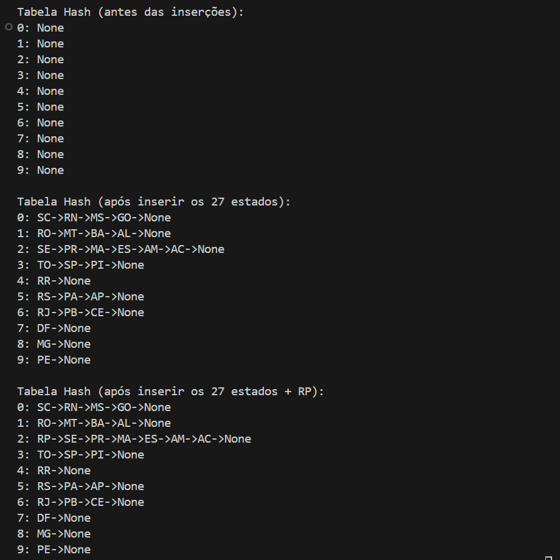

# Tabela Hash | Python

Trabalho para a disciplina Estrutura de Dados. 

O objetivo é criar um sistema de emplacamento de veículos através do endereçamento em cadeia de 10 posições (cada posição do vetor sendo uma lista encadeada):

<ul>
  <li>A entrada da função hash deve ser uma string com 2 letras, representando a sigla do estado e/ou distrito federal;</li>
  <li>Consultar livro;</li>
  <li>Caso a sigla seja DF (Distrito Federal), por questões de superstição, os deputados solicitaram que o retorno da função seja 7;</li>
  <li>
    Caso contrário, a função deve retornar a posição com base no valor ASCII das duas letras e seguindo a seguinte regra:
    

      posição = (CHAR1ascII + CHAR2ascII)MOD 10
    

    onde CHAR1ascII e CHAR2ascII são os valores ASCII da primeira e segunda letra, respectivamente.
  </li>
</ul>

Para isso, separei o projeto em algumas <a href="https://github.com/rebecaparreiras/tabela-hash/tree/main/src">dependências</a>: 

<ul>
  <li><b>main.py:</b> ponto de entrada do programa, onde cria a instância da TabelaHash, insere os estados na tabela e exibe a estrutura antes e depois das inserções;</li>
  <li><b>tabela_hash.py:</b> contém a classe TabelaHash, responsável por implementar a função hash, inserir elementos na tabela (tratando colisões com lista encadeada) e imprimir o conteúdo da tabela;</li>
  <li><b>nodo.py:</b> contém a classe Nodo, que representa cada elemento da tabela hash, armazenando a sigla, o nome e a referência para o próximo elemento na lista encadeada;</li>
  <li><b>dados_estados.py:</b> contém a lista com as siglas e nomes de todos os estados brasileiros, utilizada para popular a tabela hash;</li>
</ul>

## Preview

  

